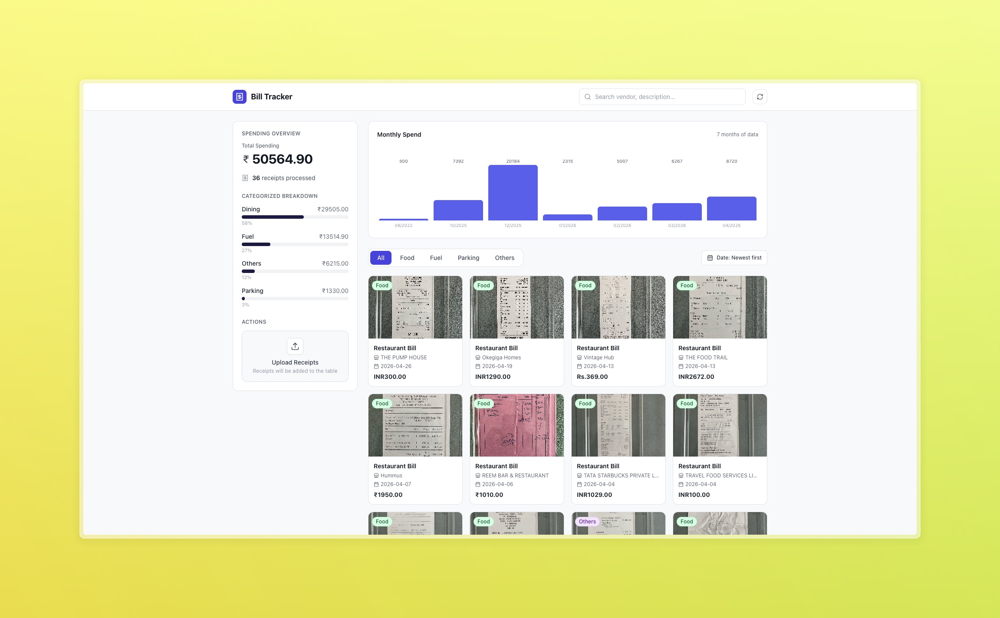
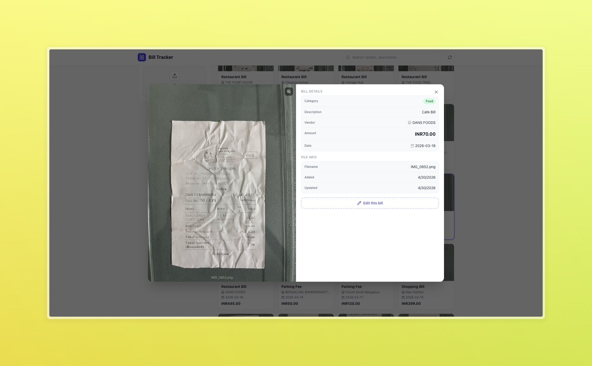
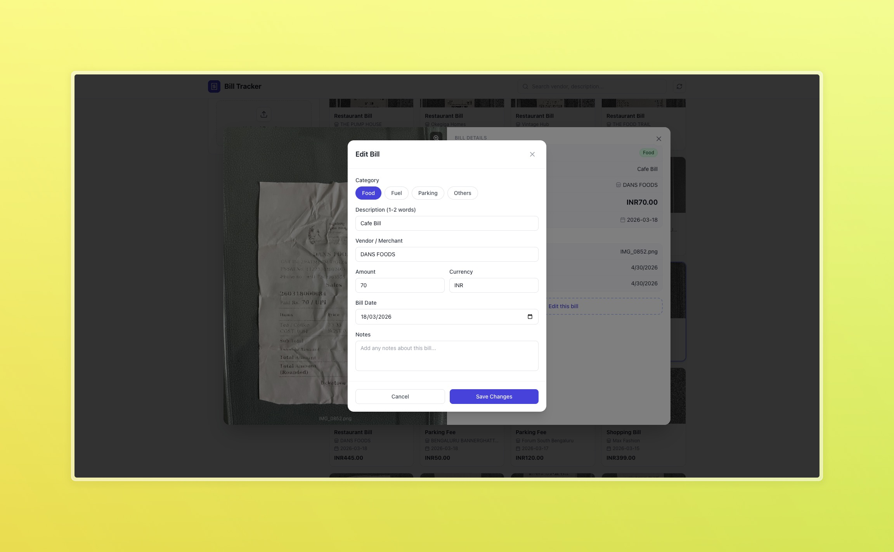

# Bill Tracker

A full-stack bill/receipt tracking application with AI-assisted extraction, manual review, and spending insights.

## Preview





## Tech Stack

- **Frontend:** React + TypeScript + Vite + TailwindCSS
- **Backend:** FastAPI + SQLite
- **AI extraction:** Google Gemini (`google-generativeai`)

## Features

- Upload one or more bill images
- Async background AI analysis for extraction
- Bill list with filtering, search, pagination, and sorting
- Edit bill details (category, vendor, amount, notes, etc.)
- Dashboard stats and monthly spend trends
- Local image serving from configured image directory

## Project Structure

```text
bill-tracker/
  backend/      # FastAPI API, SQLite, Gemini analysis
  frontend/     # React app (Vite)
  docs/images/  # README screenshot placeholders
```

## Prerequisites

- Python 3.10+ (3.12 recommended)
- Node.js 18+ and npm
- Gemini API key (for AI extraction)

## Backend Setup

```bash
cd backend
cp .env.example .env
python3 -m venv .venv
source .venv/bin/activate
pip install -r requirements.txt
uvicorn main:app --host 0.0.0.0 --port 8000 --reload
```

Backend runs at `http://localhost:8000`.

### Backend Environment Variables

Defined in `backend/.env`:

- `GEMINI_API_KEY`: Your Google Gemini API key
- `IMAGES_DIR`: Absolute path where receipt images are stored
- `DB_PATH`: SQLite path (default: `./bills.db`)
- `GEMINI_MODEL`: Model name (example: `gemini-2.5-flash`)

## Frontend Setup

```bash
cd frontend
npm install
npm run dev
```

Frontend runs at `http://localhost:5173`.

## API Overview

- `GET /api/health` - Health check
- `GET /api/bills` - List bills (supports filters, sorting, pagination)
- `GET /api/bills/{bill_id}` - Bill details
- `PUT /api/bills/{bill_id}` - Update bill metadata
- `POST /api/upload` - Upload receipt images
- `GET /api/images/{filename}` - Serve uploaded image
- `GET /api/stats` - Dashboard summary
- `GET /api/monthly` - Monthly aggregate chart data

## Notes

- CORS currently allows `http://localhost:5173` and `http://localhost:3000`.
- The frontend API base URL is set in `frontend/src/api.ts` to `http://localhost:8000`.
- If Gemini credentials are missing, uploads are still saved but AI analysis is skipped.
